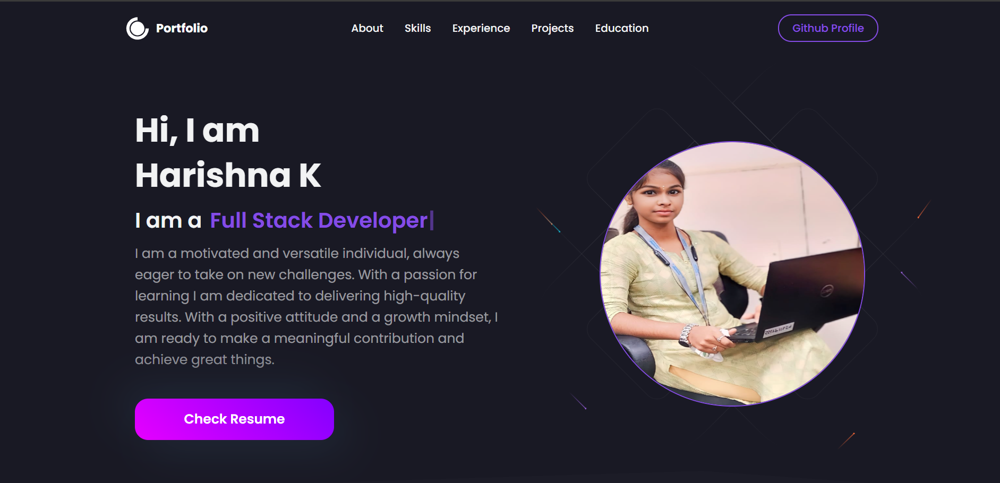

# 🧑‍💻 Harishna K — Developer Portfolio

Welcome to my personal portfolio!  
This project showcases my work, skills, projects, and experience as a Full Stack Developer, built with modern web technologies.


---

## 🚀 About Me

I'm **Harishna K**, a passionate and self-driven **Full Stack Developer** with experience in both frontend and backend technologies. I love building modern, responsive, and user-friendly web applications using tools like **React.js**, **Node.js**, and **MongoDB**.

---

## 🛠️ Tech Stack

### **Frontend**
- HTML, CSS, JavaScript
- React.js, Redux
- Bootstrap, Material UI

### **Backend**
- Node.js, Express.js

### **Database**
- MongoDB

### **Others**
- Git, GitHub, VS Code, Postman
- JSON, XML, XPath
- Pandas, CSV, Excel (Data Handling)

---

## 📁 Project Structure

```bash
.
├── public/
├── src/
│   ├── components/
│   ├── assets/
│   ├── pages/
│   ├── App.js
│   └── index.js
├── package.json
└── README.md
```

## 📌 Features

- Fully responsive design

- Dynamic project listing

- Reusable components

- Modern animations and UI

- Live links to GitHub & WebApps

- Resume download and social links (LinkedIn, GitHub, Email, WhatsApp)

---

## 🌐 Live Portfolio
🔗 View Live
https://portfolio-h1gk.vercel.app/

---

## 🧩 Projects Showcased

Tour & Travel Website — A responsive travel agency website

Eduford University — A clean and modern university website

Analog Clock — A creative animated analog clock using HTML, CSS & JS

---

## 📄 Resume
📥 Download Resume

---

## 🔗 Connect With Me

💼 LinkedIn

🧑‍💻 GitHub

📧 harishna.gkc@gmail.com

💬 WhatsApp: +91 6382628979


